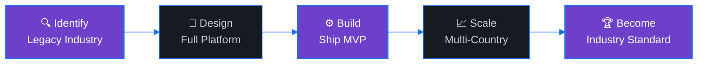

<div align="center">
  
</div>

<p align="center">
  
  &nbsp;
  
  &nbsp;
  
</p>

<p align="center">
  
</p>

---

### &nbsp;🏢&nbsp; Who We Are

<div align="center">
<table>
<tr>
<td width="50%">


<br/><br/>

**EffiFlex S.L.** is a product-focused software company
building **vertical SaaS platforms** for industries
that still run on spreadsheets, phone calls, and paper.

We don't do outsourcing. We don't do agencies.
We identify **underserved markets**, design the
full digital stack, and ship products that become
the industry standard.

<br/>


</td>
<td width="50%">

```js
const effiflex = {
  entity:    "EffiFlex S.L.",
  location:  "Valencia, Spain 🇪🇸",
  type:      "Product Company",
  markets:   ["Automotive", "Circular Economy"],
  approach: {
    find:    "Legacy industry with digital gap",
    build:   "End-to-end SaaS platform",
    deliver: "ERP + Marketplace + Automation",
    scale:   "Multi-tenant, multi-country",
  },
  principle: "Software should replace chaos,"
           + " not add to it.",
};
```

</td>
</tr>
</table>
</div>

---

### &nbsp;🚀&nbsp; What We Build

<div align="center">
<table>
<tr>
<td align="center" width="100">
  <br/>
  
  <br/><br/>
  <sub>Multi-tenant business<br/>management systems<br/>with role-based access</sub>
  <br/><br/>
</td>
<td align="center" width="100">
  
</td>
<td align="center" width="100">
  <br/>
  
  <br/><br/>
  <sub>B2B2C platforms<br/>with multi-locale SEO<br/>and instant search</sub>
  <br/><br/>
</td>
<td align="center" width="100">
  
</td>
<td align="center" width="100">
  <br/>
  
  <br/><br/>
  <sub>Third-party marketplace<br/>sync, invoicing, carrier<br/>and compliance APIs</sub>
  <br/><br/>
</td>
<td align="center" width="100">
  
</td>
<td align="center" width="100">
  <br/>
  
  <br/><br/>
  <sub>Multi-country rollout<br/>with i18n, tax compliance<br/>and regional adapters</sub>
  <br/><br/>
</td>
</tr>
</table>
</div>

---

### &nbsp;🛠️&nbsp; Tech Stack

<div align="center">

<table>
<tr>
<td align="center" width="150"><b>Frontend</b></td>
<td align="center" width="150"><b>Backend</b></td>
<td align="center" width="150"><b>Data & Storage</b></td>
<td align="center" width="150"><b>DevOps & Infra</b></td>
<td align="center" width="150"><b>Integrations</b></td>
</tr>
<tr>
<td align="center" valign="top">
  <br><sub>Next.js</sub><br>
  <br><sub>React</sub><br>
  <br><sub>TypeScript</sub><br>
  <br><sub>Tailwind</sub><br>
  <br><sub>HTML5</sub><br>
  <br><sub>CSS3 / Sass</sub>
</td>
<td align="center" valign="top">
  <br><sub>NestJS</sub><br>
  <br><sub>Node.js</sub><br>
  <br><sub>Go</sub><br>
  <br><sub>Prisma</sub><br>
  <br><sub>REST / GraphQL</sub>
</td>
<td align="center" valign="top">
  <br><sub>PostgreSQL</sub><br>
  <br><sub>Redis</sub><br>
  <br><sub>Meilisearch</sub><br>
  <br><sub>Cloudflare R2</sub><br>
  <br><sub>S3</sub>
</td>
<td align="center" valign="top">
  <br><sub>Docker</sub><br>
  <br><sub>AWS</sub><br>
  <br><sub>Traefik / Nginx</sub><br>
  <br><sub>CI / CD</sub><br>
  <br><sub>Linux</sub>
</td>
<td align="center" valign="top">
  <br><sub>Stripe</sub><br>
  <br><sub>eBay API</sub><br>
  <br><sub>Custom SMTP</sub><br>
  <br><sub>Tax APIs</sub><br>
  <br><sub>OAuth 2.0</sub>
</td>
</tr>
</table>

</div>

---

### &nbsp;🌍&nbsp; Our Approach

<div align="center">



<br/>


</div>

---

### &nbsp;📊&nbsp; GitHub Activity

<div align="center">
  <picture>
    <source media="(prefers-color-scheme: dark)" srcset="https://github-readme-stats-sigma-five.vercel.app/api?username=Burtovyi&show_icons=true&hide_border=true&count_private=true&bg_color=0d1117&title_color=6e40c9&icon_color=1f6feb&text_color=c9d1d9&ring_color=6e40c9" />
    
  </picture>
  &nbsp;&nbsp;
  <picture>
    <source media="(prefers-color-scheme: dark)" srcset="https://streak-stats.demolab.com/?user=Burtovyi&hide_border=true&background=0d1117&stroke=1f6feb&ring=6e40c9&fire=6e40c9&currStreakLabel=6e40c9&sideLabels=c9d1d9&dates=8b949e&currStreakNum=c9d1d9&sideNums=c9d1d9" />
    
  </picture>
</div>

---

### &nbsp;👤&nbsp; Founder

<div align="center">
<table>
<tr>
<td align="center" width="200">

<a href="https://github.com/Burtovyi">
  
</a>

<br/><br/>

**Oleksandr Burtovyi**

<sub>Founder & Full-Stack Engineer</sub>

<br/><br/>

<a href="https://github.com/Burtovyi">
  
</a>
<a href="https://www.linkedin.com/in/burtovyi/">
  
</a>

</td>
<td width="500">

🇺🇦 Ukrainian engineer based in Valencia, Spain.

Former CEO and practicing lawyer who pivoted
to software engineering — bringing legal precision
and business thinking to every technical decision.

Designs, builds, deploys, and scales every EffiFlex
product as a solo full-stack founder.

<br/>


</td>
</tr>
</table>
</div>

---

### &nbsp;📫&nbsp; Contact

<div align="center">

<a href="mailto:burtovyi@gmail.com">
  
</a>
&nbsp;
<a href="https://www.linkedin.com/in/burtovyi/" target="_blank">
  
</a>
&nbsp;
<a href="https://t.me/alex_burtovyi">
  
</a>

<br/><br/>

<sub>

**EffiFlex S.L.** · Valencia, Spain · 🇪🇺 European Union

</sub>

</div>

<br/>

<div align="center">
  
</div>
